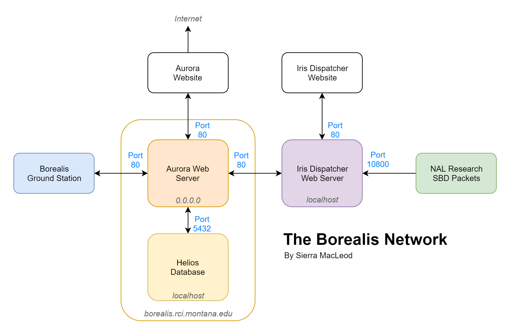

# Aurora Website
Aurora provides information about Borealis as well as an app for tracking
balloons.

## A New, Modern Design
Compared to the previous Borealis web tracking app, Aurora brings a fresh new
take on balloon tracking with some of the more cutting-edge technologies of 2019.

Built in [React](https://reactjs.org/), the app takes full advantage of
ECMAScript 2017 (ES8) language functionality to create an efficient yet
well-structured code base. Client speed is considered and emphasized to
create a faster, more reliable tracking system for users in and out of
the field.

As good user interface design is a major component in any app's effectiveness,
the react-tailored library [React-Bootstrap](https://react-bootstrap.github.io/)
is employed to bring a sleek, easily-understandable look to flight data.
Without sacrificing utility, Aurora brings the core components of any
tracking app together in the simple, satisfying way only
[Bootstrap](https://getbootstrap.com/) can.

## Structure
Aurora sits atop the Aurora Webserver, an [Express.js](https://expressjs.com/)
server providing central Borealis Network functionality. The flowchart
below shows the nature of Aurora's position and its relation to the rest of
the network.

